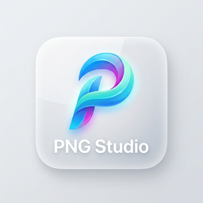
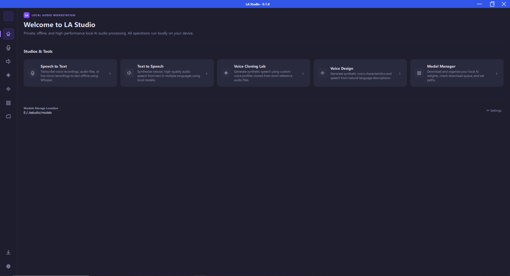
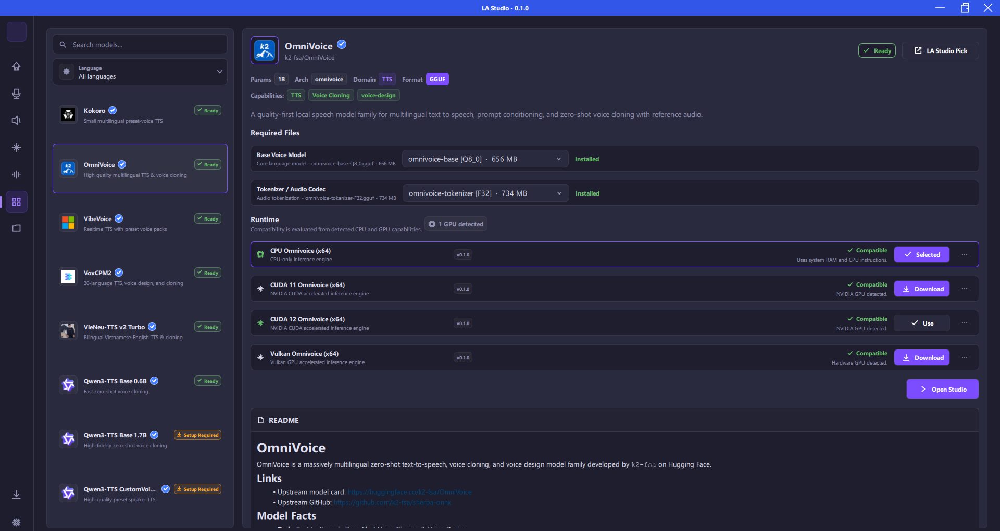
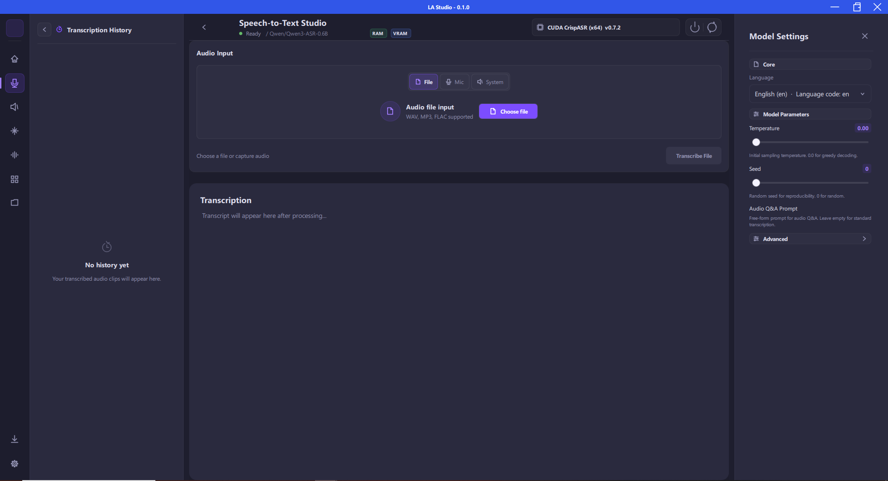
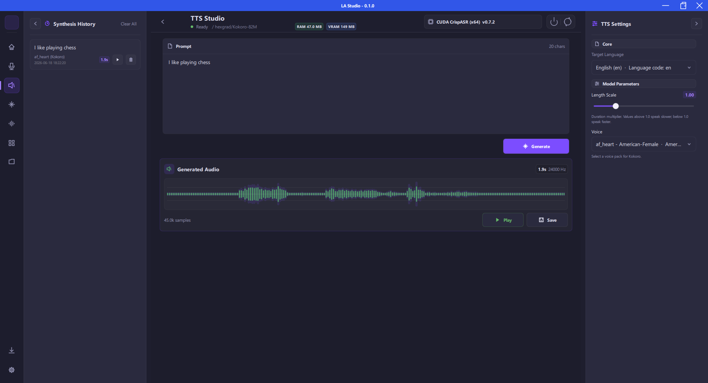
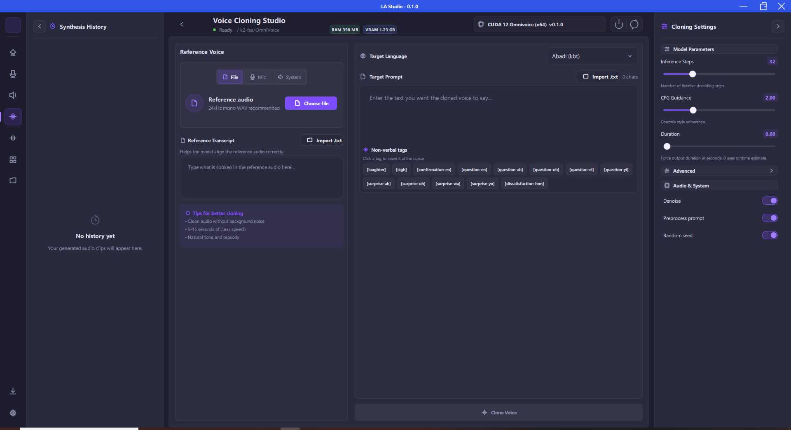
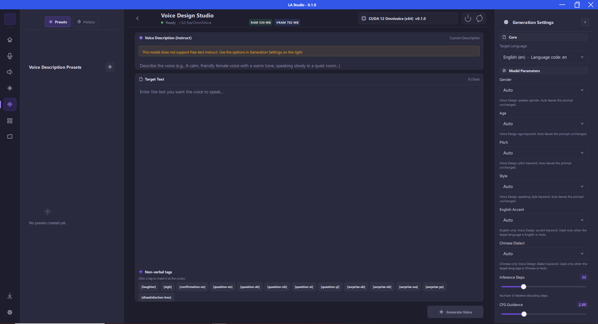
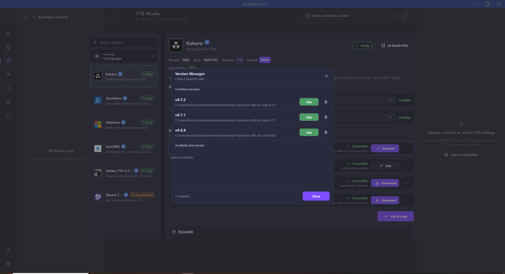
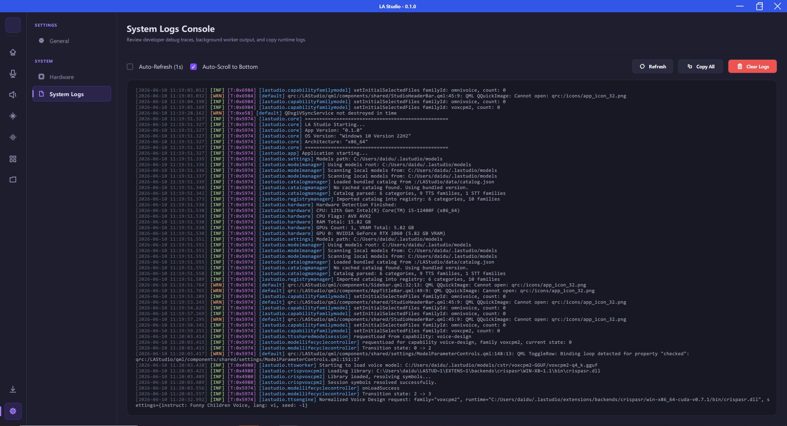
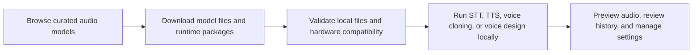

<div align="center">



<h1>LA Studio</h1>

<p><strong>Offline AI Audio Studio for Speech-to-Text, Text-to-Speech, Voice Cloning, and Voice Design</strong></p>

<p>
Run private AI audio workflows locally: speech recognition, voice generation, voice cloning, voice design, model downloads, and runtime management in one native C++/Qt desktop app.
</p>

[Features](#features) |
[Screenshots](#screenshots) |
[Use Cases](#use-cases) |
[Supported Models](#supported-models-and-runtimes) |
[Build](#build-from-source) |
[Architecture](#architecture) |
[Roadmap](#roadmap) |
[Acknowledgements](#acknowledgements)

<br>

[](https://www.gnu.org/licenses/gpl-3.0.html)
[](https://en.cppreference.com/w/cpp/compiler_support/17)
[](https://www.qt.io/)
[]()
[]()

</div>

---

## Overview

LA Studio, short for Local Audio Studio, is an offline AI audio workstation for creators, developers, researchers, and teams that need local speech AI without sending audio files, prompts, or generated voices to cloud APIs.

The app brings together local speech-to-text, text-to-speech, voice cloning, voice design, model discovery, Hugging Face downloads, runtime installation, hardware checks, and audio preview tools behind a modern desktop interface. It is built with C++17, Qt 6/QML, CMake, and native AI runtime adapters for fast local inference.

## Features

| Feature | What it does | Local AI / Runtime focus |
| --- | --- | --- |
| Speech-to-Text Studio | Transcribe microphone input or audio files into text with local speech recognition models. | Whisper, Qwen3-ASR, CrispASR-compatible STT backends |
| Text-to-Speech Studio | Generate natural speech from text with configurable model parameters and audio preview. | Kokoro, Qwen3-TTS, VibeVoice, VieNeu-TTS, OmniVoice, VoxCPM2 |
| Voice Cloning | Create speech from a reference voice sample for local zero-shot voice cloning workflows. | GGUF and native runtime packages |
| Voice Design | Generate or shape voices from descriptive text prompts when supported by the selected model. | VoxCPM2, Qwen3 voice design, OmniVoice-style workflows |
| Models Gallery | Browse curated model families, inspect required files, download assets, and manage local model availability. | Integrated catalog and Hugging Face sources |
| Runtime Management | Install, validate, and select compatible CPU, CUDA, Vulkan, or other runtime packages. | Dynamic runtime loading |
| Offline Privacy | Keep audio, prompts, generated speech, and model inference on the user's machine. | No cloud API required for inference |
| Native Desktop UI | Use a responsive Qt Quick interface with audio input controls, waveform previews, history, settings, and logs. | C++17 + Qt 6/QML |

## Screenshots

| Home | Models Gallery |
| --- | --- |
|  |  |

| Speech-to-Text | Text-to-Speech |
| --- | --- |
|  |  |

| Voice Cloning | Voice Design |
| --- | --- |
|  |  |

| Runtime Settings | System Logs |
| --- | --- |
|  |  |

## Use Cases

- Run private speech transcription locally for interviews, meetings, research recordings, podcasts, and voice notes.
- Generate local voiceovers for video, learning content, prototypes, narration, and accessibility workflows.
- Test multiple open speech and audio models from a single desktop interface.
- Build and validate model catalogs, runtime packages, and Hugging Face download flows.
- Experiment with voice cloning and voice design without relying on external inference APIs.
- Develop C++/Qt integrations for local AI audio workflows.

## How LA Studio Works



1. Open the model gallery and choose an STT, TTS, voice cloning, or voice design model family.
2. Download the required model files and runtime package from the app.
3. LA Studio validates local files, runtime compatibility, and available hardware acceleration.
4. Use the studio pages to transcribe audio, generate speech, clone voices, or design voices offline.

## Supported Models and Runtimes

LA Studio is catalog-driven, so supported models can evolve without rewriting the core UI. Current catalog families include:

| Category | Example model families |
| --- | --- |
| Speech-to-Text | Whisper, Qwen3-ASR 0.6B, Qwen3-ASR 1.7B |
| Text-to-Speech | Kokoro 82M, VibeVoice Realtime, VieNeu-TTS v2 Turbo, Qwen3-TTS |
| Voice Cloning | VoxCPM2, OmniVoice, Qwen3 custom voice packages |
| Voice Design | VoxCPM2 voice design, Qwen3 voice design packages |

Runtime support is handled through native adapters and dynamic libraries. Depending on model availability and platform support, LA Studio can use CPU, CUDA, Vulkan, and other runtime-specific acceleration paths.

## Technology Stack

- **Language:** C++17
- **UI:** Qt 6, Qt Quick, QML, Qt Quick Controls
- **Build:** CMake, Ninja, CMake presets
- **Dependencies:** vcpkg manifest mode, libcurl
- **Audio:** Qt Multimedia, WAV utilities, waveform provider, audio recorder, audio player
- **Model sources:** Local catalog data and Hugging Face download sources
- **Architecture:** MVVM-style QML/C++ controller layer with dynamic AI runtime backends

## Project Structure

```text
LA-Studio/
|-- CMakeLists.txt              # Top-level CMake build configuration
|-- CMakePresets.json           # Build presets
|-- vcpkg.json                  # C++ dependency manifest
|-- catalog-src/                # Source catalog data for model families
|-- data/                       # Generated runtime catalog and schema
|-- docs/                       # Public documentation
|   |-- BUILD.md                # Windows build guide
|   |-- README.md               # Documentation index
|   `-- screenshots/            # Product screenshots for this README
|-- include/runtimes/           # Runtime interface headers
|-- qml/                        # Qt Quick user interface
|   |-- Main.qml
|   |-- Theme.qml
|   |-- pages/
|   `-- components/
|-- scripts/                    # Bootstrap, build, test, package, and catalog scripts
|-- src/                        # C++ application source
|   |-- audio/
|   |-- controllers/
|   |-- core/
|   |-- stt/
|   `-- tts/
`-- tests/                      # Unit tests and mocks
```

## Build From Source

The primary development path is Windows with MSVC 2022, Qt 6, CMake, Ninja, and vcpkg.

### Prerequisites

- Visual Studio 2022 or Build Tools with the MSVC x64 toolchain
- Qt 6.5+ with the `msvc2022_64` kit
- CMake 3.21+
- Ninja
- Git

### Quick Start

```powershell
git clone https://github.com/dduongtrandai/LA-Studio.git
cd LA-Studio
.\scripts\bootstrap.bat
```

After a successful release build, run:

```powershell
.\out\build\windows-msvc-release\LA Studio.exe
```

For a faster development build that skips deployment:

```powershell
.\scripts\bootstrap.bat -SkipDeploy
```

For an explicit Qt path:

```powershell
.\scripts\bootstrap.bat -QtRoot C:\Qt\6.9.3
```

For detailed setup, troubleshooting, and preset notes, see [docs/BUILD.md](docs/BUILD.md).

## Testing

Run the test script from the repository root:

```powershell
.\scripts\run_tests.bat
```

The `tests/` directory includes focused coverage for model path migration, model and runtime flows, download/install behavior, audio preview behavior, file access, history, and STT session logic.

## Architecture

LA Studio uses a QML front end with C++ controllers and core managers. The app keeps model catalog logic, downloads, runtime discovery, hardware checks, audio services, and studio actions behind clear C++ service boundaries.

```text
QML UI
  |
  | Qt properties, signals, and slots
  v
AppController and studio controllers
  |
  | Session state, user actions, model selection
  v
Core services and managers
  |
  | Catalogs, downloads, settings, registry, hardware, logging
  v
Audio services and AI runtimes
  |
  | STT, TTS, voice cloning, voice design backends
  v
Local model files and runtime libraries
```

Key source areas:

- `src/controllers/` bridges QML screens to application services.
- `src/core/` manages catalogs, models, downloads, settings, runtimes, registry, hardware, and logging.
- `src/audio/` provides recording, playback, WAV handling, and waveform support.
- `src/stt/` contains speech-to-text engine and backend selection.
- `src/tts/` contains text-to-speech engine, validation, workers, and backend selection.

## Privacy and Offline Operation

LA Studio is designed for local inference. Audio recordings, prompts, generated speech, transcriptions, model selections, and runtime activity stay on the local machine unless the user explicitly downloads model files or runtime packages from external sources.

## Documentation

- [Build from Source](docs/BUILD.md)
- [Documentation Index](docs/README.md)
- [Catalog and Local Registry Architecture](docs/architecture/catalog_registry.md)

## Roadmap

- [x] Local speech-to-text studio
- [x] Local text-to-speech studio
- [x] Model gallery and managed downloads
- [x] Runtime and hardware management
- [x] Voice cloning workflow foundation
- [x] Voice design workflow foundation
- [ ] Broader cross-platform packaging
- [ ] Expanded model validation and benchmark reporting
- [ ] Advanced timeline-style audio editing
- [ ] Additional local speech-to-speech and multimodal audio workflows

## Contributing

Contributions are welcome. Good first areas include UI polish, catalog metadata, runtime adapters, tests, documentation, packaging, and model compatibility validation.

Before changing architecture-heavy code, review the public docs in `docs/` and keep implementation changes aligned with the existing controller, service, and runtime boundaries.

## Acknowledgements

LA Studio exists because of the open-source runtime, tooling, and model ecosystems around local speech AI. Thank you to the maintainers and contributors of these projects:

- [whisper.cpp](https://github.com/ggml-org/whisper.cpp) and [OpenAI Whisper](https://github.com/openai/whisper) for local Whisper speech recognition support.
- [CrispASR](https://github.com/CrispStrobe/CrispASR) for GGUF runtime packages used by Qwen3-ASR, Qwen3-TTS, Kokoro, VoxCPM2, and VibeVoice workflows in LA Studio.
- [omnivoice.cpp](https://github.com/dduongtrandai/omnivoice.cpp) and the [k2-fsa / sherpa-onnx](https://github.com/k2-fsa/sherpa-onnx) ecosystem for OmniVoice runtime integration.
- [speech-lm-tts.cpp](https://github.com/dduongtrandai/speech-lm-tts.cpp) for VieNeu-TTS runtime integration.
- The model authors and communities behind [Kokoro](https://github.com/hexgrad/kokoro), [Qwen speech models](https://github.com/QwenLM), [VoxCPM2](https://huggingface.co/openbmb/VoxCPM2), [VibeVoice](https://huggingface.co/microsoft/VibeVoice-Realtime-0.5B), [OmniVoice](https://huggingface.co/k2-fsa/OmniVoice), and [VieNeu-TTS](https://huggingface.co/pnnbao-ump/VieNeu-TTS-v2-Turbo).

Runtime packages and model files may have their own licenses, terms, and attribution requirements. Please review the upstream project and model licenses before redistributing any bundled runtime or model assets.

## License

LA Studio is released under the **GNU General Public License v3.0**. Check out `LICENSE` for more details.

---

**LA Studio helps you run private, local AI audio workflows on your own machine.**

